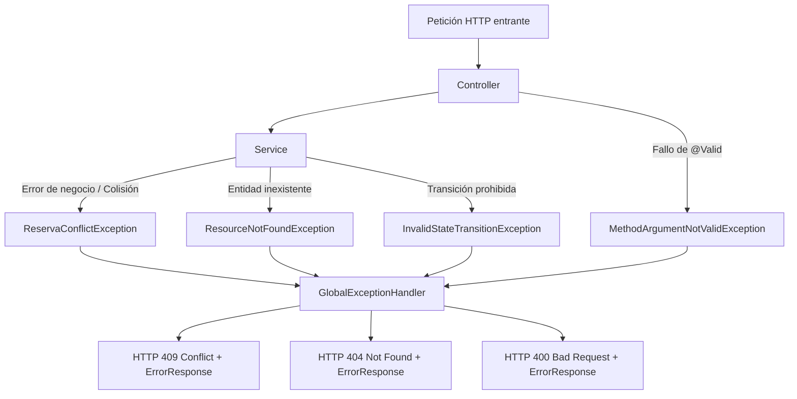
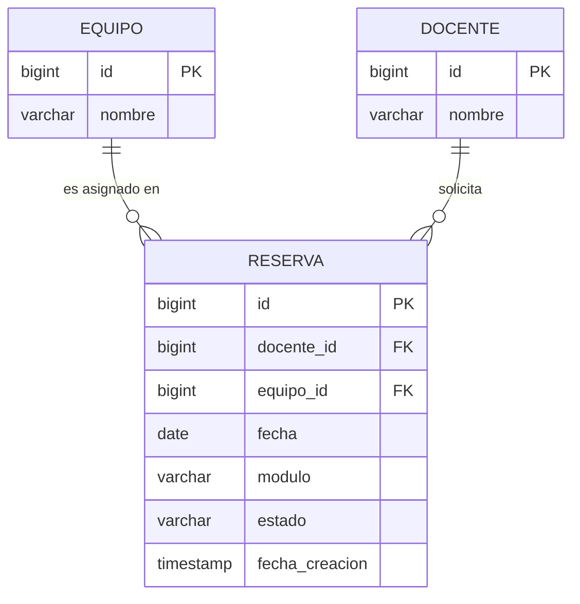
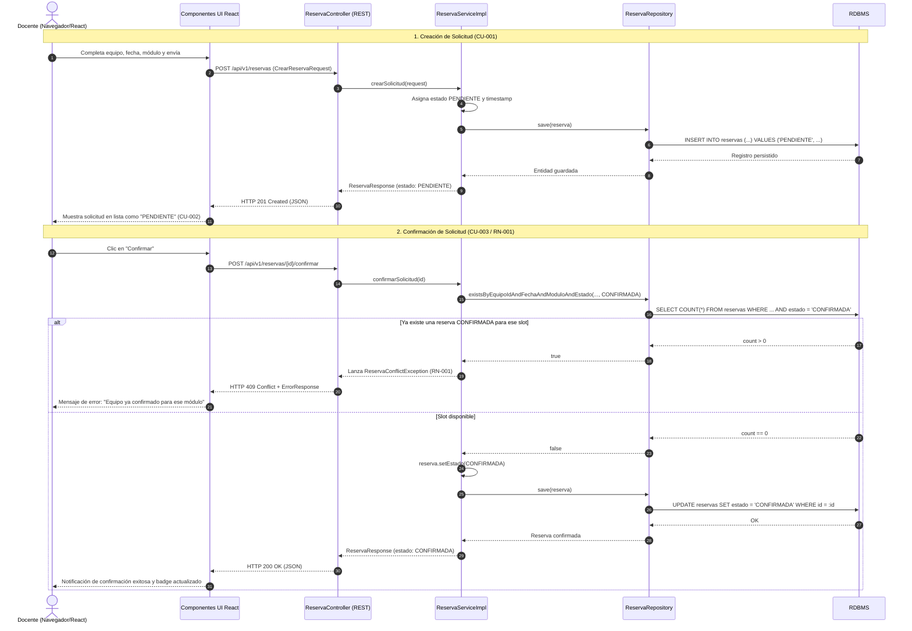

# Arquitectura Técnica - Biblioteca Horizonte
## MVP: Gestión de Solicitudes de Reserva de Equipos

---

### 1. Estructura de Carpetas del Backend (Spring Boot)

La arquitectura backend sigue el estándar de una aplicación monolítica por capas (Layered Architecture), empaquetada por tipo de componente (package-by-layer) para facilitar la trazabilidad y simplicidad académica:

```text
backend/
├── pom.xml
└── src/
    ├── main/
    │   ├── java/
    │   │   └── com/
    │   │       └── biblioteca/
    │   │           └── horizonte/
    │   │               ├── BibliotecaHorizonteApplication.java
    │   │               ├── controller/
    │   │               │   ├── ReservaController.java
    │   │               │   └── EquipoController.java
    │   │               ├── service/
    │   │               │   ├── ReservaService.java
    │   │               │   └── impl/
    │   │               │       └── ReservaServiceImpl.java
    │   │               ├── repository/
    │   │               │   ├── ReservaRepository.java
    │   │               │   └── EquipoRepository.java
    │   │               ├── model/
    │   │               │   ├── Reserva.java
    │   │               │   ├── Equipo.java
    │   │               │   ├── Docente.java
    │   │               │   └── EstadoReserva.java
    │   │               ├── dto/
    │   │               │   ├── request/
    │   │               │   │   └── CrearReservaRequest.java
    │   │               │   └── response/
    │   │               │       ├── ReservaResponse.java
    │   │               │       ├── EquipoResponse.java
    │   │               │       └── ErrorResponse.java
    │   │               └── exception/
    │   │                   ├── GlobalExceptionHandler.java
    │   │                   ├── ResourceNotFoundException.java
    │   │                   ├── ReservaConflictException.java
    │   │                   └── InvalidStateTransitionException.java
    │   └── resources/
    │       ├── application.properties
    │       ├── application-dev.properties
    │       ├── application-prod.properties
    │       └── data.sql
    └── test/
        └── java/
            └── com/
                └── biblioteca/
                    └── horizonte/
                        ├── controller/
                        │   └── ReservaControllerTest.java
                        ├── service/
                        │   └── ReservaServiceTest.java
                        └── repository/
                            └── ReservaRepositoryTest.java
```

---

### 2. Estructura de Carpetas del Frontend (React + TypeScript + Vite)

Estructura modular orientada a vistas y componentes reutilizables con tipado estricto:

```text
frontend/
├── index.html
├── package.json
├── tsconfig.json
├── vite.config.ts
└── src/
    ├── main.tsx
    ├── App.tsx
    ├── api/
    │   ├── apiClient.ts          // Configuración base de fetch / axios
    │   └── reservaApi.ts         // Funciones para invocar endpoints de reservas
    ├── components/
    │   ├── common/
    │   │   ├── Navbar.tsx
    │   │   └── StatusBadge.tsx   // Píldora visual para PENDIENTE, CONFIRMADA, RECHAZADA
    │   ├── reserva/
    │   │   ├── ReservaForm.tsx   // Formulario de nueva reserva
    │   │   ├── ReservaList.tsx   // Tabla/grilla de reservas existentes
    │   │   └── ReservaActions.tsx// Botones Confirmar / Rechazar
    │   └── ui/
    │       ├── Alert.tsx
    │       └── Button.tsx
    ├── pages/
    │   ├── ReservasPage.tsx      // Listado principal con estados y acciones
    │   └── NuevaReservaPage.tsx  // Pantalla para emitir una solicitud
    ├── types/
    │   └── reserva.ts            // Interfaces TypeScript (Reserva, EstadoReserva, DTOs)
    └── styles/
        └── index.css             // Estilos globales de la aplicación
```

---

### 3. Capas del Backend

1. **Capa Web / Controlador (`controller`):**
   - Responsable de exponer los endpoints REST vía HTTP.
   - Recibe y valida las peticiones (`@Valid`).
   - Delega la lógica de negocio a la capa de servicio.
   - Transforma entidades a DTOs de salida y gestiona los códigos de estado HTTP (200, 201, 400, 404, 409, 500).

2. **Capa de Negocio / Servicio (`service`):**
   - Implementa los casos de uso (CU-001 a CU-004) y las reglas de negocio (RN-001 a RN-005).
   - Controla transacciones (`@Transactional`).
   - Aplica validaciones de disponibilidad del slot (equipo + fecha + módulo) antes de permitir la confirmación.
   - Lanza excepciones de dominio específicas ante conflictos o estados inconsistentes.

3. **Capa de Persistencia / Acceso a Datos (`repository`):**
   - Interfaces que extienden `JpaRepository<T, ID>`.
   - Ejecuta consultas derivadas o métodos `@Query` con bloqueos o filtros específicos para garantizar la consistencia.

4. **Capa de Dominio / Entidades (`model`):**
   - Clases JPA que mapean las tablas relacionales.
   - Protegen los invariantes mínimos del ciclo de vida del estado.

---

### 4. Entidades

#### **`Reserva` (Entidad principal)**
- Mapea la tabla `reservas`.
- Atributos:
  - `Long id`: Clave primaria autoincremental.
  - `Long docenteId`: Identificador del docente solicitante.
    *[DECISIÓN PENDIENTE: Definir si se vincula como entidad `@ManyToOne Docente` o si se almacena únicamente como identificador numérico/legajo en el MVP].*
  - `Equipo equipo`: Relación `@ManyToOne(optional = false)` con la entidad `Equipo`.
  - `LocalDate fecha`: Fecha de calendario para la reserva.
  - `String modulo`: Módulo horario solicitado.
    *[DECISIÓN PENDIENTE: Definir si el módulo es texto libre o un Enum tipado con horarios institucionales predefinidos (ej. M1, M2)].*
  - `EstadoReserva estado`: Enumeración (`PENDIENTE`, `CONFIRMADA`, `RECHAZADA`).
  - `LocalDateTime fechaCreacion`: Marca temporal generada al persistir la solicitud.

#### **`Equipo` (Entidad de recurso)**
- Mapea la tabla `equipos`.
- Atributos:
  - `Long id`: Clave primaria.
  - `String nombre`: Denominación del equipo (ej: "Proyector EPSON Aula Magna", "Carro de Tablets #2").
    *[DECISIÓN PENDIENTE: Definir si el equipo contiene más atributos como código de inventario, estado operativo o categoría].*

#### **`Docente` (Entidad referencial)**
- *[DECISIÓN PENDIENTE: El requerimiento no especifica gestión de usuarios/login. Se sugiere tabla referencial mínima para listar docentes en el formulario del MVP].*
- Atributos:
  - `Long id`: Clave primaria.
  - `String nombre`: Nombre completo del docente.

#### **`EstadoReserva` (Enum)**
- Valores posibles:
  - `PENDIENTE`: Estado inicial de toda solicitud.
  - `CONFIRMADA`: Reserva aprobada y con slot asignado exclusivamente.
  - `RECHAZADA`: Solicitud descartada.

---

### 5. Data Transfer Objects (DTOs)

#### **DTOs de Entrada (Requests)**
- **`CrearReservaRequest`**:
  - `Long docenteId` (Obligatorio)
  - `Long equipoId` (Obligatorio)
  - `LocalDate fecha` (Obligatorio, no nula)
    *[DECISIÓN PENDIENTE: Validar si la fecha debe ser estrictamente `@FutureOrPresent`].*
  - `String modulo` (Obligatorio, no vacío)

#### **DTOs de Salida (Responses)**
- **`ReservaResponse`**:
  - `Long id`
  - `Long docenteId`
  - `Long equipoId`
  - `String equipoNombre`
  - `LocalDate fecha`
  - `String modulo`
  - `EstadoReserva estado`
  - `LocalDateTime fechaCreacion`
- **`EquipoResponse`**:
  - `Long id`
  - `String nombre`
- **`ErrorResponse`**:
  - `LocalDateTime timestamp`
  - `int status`
  - `String error`
  - `String codigo`
  - `String mensaje`
  - `String path`
  - `Map<String, String> validaciones` *(Opcional, presente en errores 400)*

---

### 6. Repositories (Spring Data JPA)

#### **`ReservaRepository`**
```java
public interface ReservaRepository extends JpaRepository<Reserva, Long> {

    // Consulta para verificar colisión antes de confirmar (RN-001)
    boolean existsByEquipoIdAndFechaAndModuloAndEstado(
        Long equipoId, 
        LocalDate fecha, 
        String modulo, 
        EstadoReserva estado
    );

    // Búsqueda opcional para auditoría o visualización filtrada
    List<Reserva> findByDocenteId(Long docenteId);
    List<Reserva> findByFecha(LocalDate fecha);
}
```

#### **`EquipoRepository`**
```java
public interface EquipoRepository extends JpaRepository<Equipo, Long> {
}
```

---

### 7. Services

#### **`ReservaService` (Interfaz)**
```java
public interface ReservaService {
    ReservaResponse crearSolicitud(CrearReservaRequest request);
    List<ReservaResponse> listarTodas();
    ReservaResponse obtenerPorId(Long id);
    ReservaResponse confirmarSolicitud(Long id);
    ReservaResponse rechazarSolicitud(Long id);
}
```

#### **Lógica central en `ReservaServiceImpl`**:
- **Creación (`crearSolicitud`):**
  1. Verifica existencia del equipo mediante `EquipoRepository`.
  2. Inicializa la reserva con `estado = EstadoReserva.PENDIENTE` (**RN-002**).
  3. Registra `fechaCreacion = LocalDateTime.now()`.
  4. Persiste y retorna `ReservaResponse`.
- **Confirmación (`confirmarSolicitud`):**
  1. Busca la reserva por ID; si no existe lanza `ResourceNotFoundException`.
  2. Valida que el estado actual sea `PENDIENTE` (**RN-003**); si no, lanza `InvalidStateTransitionException`.
  3. Valida mediante `existsByEquipoIdAndFechaAndModuloAndEstado(..., EstadoReserva.CONFIRMADA)` que no exista otra confirmada para esa tupla (**RN-001**). Si existe, lanza `ReservaConflictException`.
  4. Cambia estado a `CONFIRMADA` y persiste bajo contexto transaccional (`@Transactional`).
- **Rechazo (`rechazarSolicitud`):**
  1. Busca la reserva por ID; si no existe lanza `ResourceNotFoundException`.
  2. Valida que el estado actual sea `PENDIENTE` (**RN-003**); si no, lanza `InvalidStateTransitionException`.
  3. Cambia estado a `RECHAZADA` y persiste bajo contexto transaccional.

---

### 8. Controllers

#### **`ReservaController`**
- Rutas expuestas:
  - `POST /api/v1/reservas`: Registra nueva solicitud (`@Valid @RequestBody CrearReservaRequest`). Retorna `201 Created`.
  - `GET /api/v1/reservas`: Retorna lista completa de solicitudes. Retorna `200 OK`.
  - `GET /api/v1/reservas/{id}`: Retorna una solicitud puntual. Retorna `200 OK`.
  - `POST /api/v1/reservas/{id}/confirmar`: Ejecuta confirmación. Retorna `200 OK`.
  - `POST /api/v1/reservas/{id}/rechazar`: Ejecuta rechazo. Retorna `200 OK`.

#### **`EquipoController`**
- Rutas expuestas:
  - `GET /api/v1/equipos`: Permite al frontend poblar el combo selector de equipos disponibles en el formulario. Retorna `200 OK`.

---

### 9. Manejo Global de Excepciones

Implementado mediante `@RestControllerAdvice` (`GlobalExceptionHandler`):



- **`MethodArgumentNotValidException` (`HTTP 400 Bad Request`):** Extrae los errores de los campos anotados con Bean Validation y los adjunta en el campo `validaciones`.
- **`ResourceNotFoundException` (`HTTP 404 Not Found`):** Lanzada cuando el ID de reserva o equipo no existe.
- **`ReservaConflictException` (`HTTP 409 Conflict`):** Lanzada cuando se intenta confirmar un slot que ya posee una reserva confirmada (**RN-001**).
- **`InvalidStateTransitionException` (`HTTP 409 Conflict`):** Lanzada cuando se intenta confirmar o rechazar una reserva que no está en `PENDIENTE` (**RN-003**).
- **`Exception` (`HTTP 500 Internal Server Error`):** Captura de fallos imprevistos, logueando el stack trace y devolviendo un mensaje genérico seguro.

---

### 10. Validaciones (Bean Validation)

En `CrearReservaRequest`:
- `@NotNull(message = "El identificador del docente es obligatorio")` sobre `docenteId`.
- `@NotNull(message = "El identificador del equipo es obligatorio")` sobre `equipoId`.
- `@NotNull(message = "La fecha de reserva es obligatoria")` sobre `fecha`.
  *[DECISIÓN PENDIENTE: Determinar si se agrega `@FutureOrPresent` para impedir solicitudes con fechas anteriores al día de hoy].*
- `@NotBlank(message = "El módulo horario es obligatorio")` sobre `modulo`.

---

### 11. Contrato REST Preliminar

*(El detalle exhaustivo de payloads, códigos y cabeceras se encuentra documentado en [API.md](file:///c:/Users/Usuario/Desktop/proyecto/Biblioteca-horizonte/docs/API.md)).*

| Endpoint | Método | Descripción | Códigos HTTP |
| :--- | :--- | :--- | :--- |
| `/api/v1/reservas` | `POST` | Crea una solicitud en estado `PENDIENTE` | 201, 400, 404 |
| `/api/v1/reservas` | `GET` | Lista las solicitudes de reserva | 200 |
| `/api/v1/reservas/{id}` | `GET` | Obtiene el detalle de una solicitud | 200, 404 |
| `/api/v1/reservas/{id}/confirmar` | `POST` | Confirma una solicitud pendiente | 200, 404, 409 |
| `/api/v1/reservas/{id}/rechazar` | `POST` | Rechaza una solicitud pendiente | 200, 404, 409 |
| `/api/v1/equipos` | `GET` | Lista los equipos para selector UI | 200 |

---

### 12. Modelo de Base de Datos Relacional

#### **Tabla `equipos`**
- `id` BIGINT GENERATED BY DEFAULT AS IDENTITY PRIMARY KEY
- `nombre` VARCHAR(120) NOT NULL

#### **Tabla `reservas`**
- `id` BIGINT GENERATED BY DEFAULT AS IDENTITY PRIMARY KEY
- `docente_id` BIGINT NOT NULL
- `equipo_id` BIGINT NOT NULL
- `fecha` DATE NOT NULL
- `modulo` VARCHAR(50) NOT NULL
- `estado` VARCHAR(20) NOT NULL
- `fecha_creacion` TIMESTAMP NOT NULL
- **Foreign Key:** `fk_reservas_equipo` (`equipo_id`) REFERENCES `equipos`(`id`)
- **Índice de búsqueda:** `idx_reservas_slot` (`equipo_id`, `fecha`, `modulo`, `estado`)

```sql
CREATE TABLE equipos (
    id BIGINT GENERATED BY DEFAULT AS IDENTITY PRIMARY KEY,
    nombre VARCHAR(120) NOT NULL
);

CREATE TABLE reservas (
    id BIGINT GENERATED BY DEFAULT AS IDENTITY PRIMARY KEY,
    docente_id BIGINT NOT NULL,
    equipo_id BIGINT NOT NULL,
    fecha DATE NOT NULL,
    modulo VARCHAR(50) NOT NULL,
    estado VARCHAR(20) NOT NULL,
    fecha_creacion TIMESTAMP NOT NULL,
    CONSTRAINT fk_reservas_equipo FOREIGN KEY (equipo_id) REFERENCES equipos(id),
    CONSTRAINT chk_reservas_estado CHECK (estado IN ('PENDIENTE', 'CONFIRMADA', 'RECHAZADA'))
);
```

---

### 13. Relaciones entre Entidades



- Relación `Equipo` a `Reserva`: Uno a Muchos (`1:N`). Un equipo puede estar vinculado a múltiples solicitudes históricas o pendientes, pero solo a una confirmada por fecha y módulo.
- Relación `Docente` a `Reserva`: Uno a Muchos (`1:N`).

---

### 14. Flujo Completo de una Solicitud



---

### 15. Estrategia para Garantizar la Regla Fundamental (RN-001)

> **Regla RN-001:** No puede existir más de una reserva CONFIRMADA para el mismo equipo + fecha + módulo.

Dado que múltiples solicitudes pueden coexistir en estado `PENDIENTE` para el mismo slot (**RN-004**), un índice único tradicional `UNIQUE(equipo_id, fecha, modulo)` en toda la tabla rompería la funcionalidad al impedir registrar varias solicitudes pendientes.

Se adopta una **estrategia de doble barrera (Aplicación + Base de Datos)**:

1. **Barrera a Nivel de Aplicación (Spring Boot Service):**
   - La operación de confirmación se ejecuta bajo una transacción `@Transactional`.
   - Antes de modificar el estado, se consulta activamente si existe una reserva en estado `CONFIRMADA` para esa combinación:
     ```java
     boolean ocupado = reservaRepository.existsByEquipoIdAndFechaAndModuloAndEstado(
         reserva.getEquipo().getId(),
         reserva.getFecha(),
         reserva.getModulo(),
         EstadoReserva.CONFIRMADA
     );
     if (ocupado) {
         throw new ReservaConflictException("Conflicto: Ya existe una reserva confirmada para este equipo, fecha y módulo.");
     }
     ```

2. **Barrera de Integridad a Nivel de Base de Datos:**
   - **Opción Principal (RDBMS con soporte de índices parciales, ej. PostgreSQL):**
     Índice único condicional que aplica la restricción de unicidad **únicamente** a las filas donde `estado = 'CONFIRMADA'`:
     ```sql
     CREATE UNIQUE INDEX uq_reserva_confirmada_slot 
     ON reservas (equipo_id, fecha, modulo) 
     WHERE estado = 'CONFIRMADA';
     ```
     Esta instrucción garantiza que a nivel físico de la base de datos sea imposible insertar o actualizar dos filas con estado `CONFIRMADA` para el mismo slot, neutralizando cualquier condición de carrera concurrente.

   - **Opción de Compatibilidad para H2 / Motores sin índice parcial:**
     *[DECISIÓN PENDIENTE: Si se usa un motor que no soporte índices condicionales, se implementará bloqueo pesimista en la consulta del Service (`LockModeType.PESSIMISTIC_WRITE`) sobre el equipo o registro involucrado durante la confirmación].*

---

### 16. Estrategia de Testing

Pirámide de pruebas simple y orientada a los criterios de aceptación:

```text
       / \
      / E2E \         (Flujo completo API <-> DB)
     /-------\
    /  Integ  \       (Repository tests con H2 + Concurrencia RN-001)
   /-----------\
  /   Unitarias \     (Service logic + Controller @WebMvcTest)
 /---------------\
```

1. **Pruebas Unitarias de Negocio (`ReservaServiceTest`):**
   - Frameworks: JUnit 5 + Mockito.
   - Casos:
     - Creación en estado inicial `PENDIENTE`.
     - Confirmación exitosa cuando no hay colisión previa.
     - Lanzamiento de `ReservaConflictException` cuando existe reserva `CONFIRMADA` para el mismo slot (**RN-001**).
     - Lanzamiento de `InvalidStateTransitionException` al intentar confirmar o rechazar una reserva que no está en `PENDIENTE`.

2. **Pruebas de Repositorio e Integridad (`ReservaRepositoryTest`):**
   - Framework: `@DataJpaTest` con base de datos H2 en memoria.
   - Casos:
     - Inserción de múltiples solicitudes `PENDIENTE` para el mismo slot (debe permitirse).
     - Validación del índice único condicional (intento de persistir dos reservas `CONFIRMADA` para el mismo slot debe disparar `DataIntegrityViolationException`).

3. **Pruebas de Controladores Web (`ReservaControllerTest`):**
   - Framework: `@WebMvcTest(ReservaController.class)` con `MockMvc`.
   - Casos:
     - Validación de Bean Validation: Envío de JSON vacío retorna 400 Bad Request.
     - Mapeo correcto de códigos HTTP 201, 200, 404 y 409.

4. **Pruebas Frontend:**
   - Framework: Vitest + React Testing Library.
   - Casos: Renderizado del formulario, deshabilitación de botones ante acciones y presentación de mensajes de error de la API.

---

### 17. Configuración de Ambientes

#### **Ambiente Local / Desarrollo (`dev`)**
- Perfil Spring: `dev` (`application-dev.properties`).
- Base de Datos: H2 in-memory (`jdbc:h2:mem:bibliotecadb`) o PostgreSQL local en Docker.
- `spring.jpa.hibernate.ddl-auto`: `update` o `create-drop`.
- Carga de datos iniciales automática vía `data.sql` (inserta equipos de prueba).
- Consola H2 habilitada en `/h2-console` para inspección rápida de docentes y reservas.
- Frontend Vite: Proxy configurado en `vite.config.ts` apuntando a `http://localhost:8080`.

#### **Ambiente Producción / Evaluación (`prod`)**
- Perfil Spring: `prod` (`application-prod.properties`).
- Base de Datos: PostgreSQL / MySQL externo.
- Parámetros sensibles inyectados mediante variables de entorno:
  - `SPRING_DATASOURCE_URL`
  - `SPRING_DATASOURCE_USERNAME`
  - `SPRING_DATASOURCE_PASSWORD`
- `spring.jpa.hibernate.ddl-auto`: `validate` (o script de inicialización controlado).
- Consola H2 deshabilitada.

---

### 18. Decisiones Técnicas no especificadas en el SSD `[DECISIÓN PENDIENTE]`

1. **`[DECISIÓN PENDIENTE]` Formato del campo `modulo`:**
   Actualmente se modela como `String` (ej. `"M1"`, `"08:00-09:30"`). Se requiere confirmación si debe ser un catálogo de módulos predefinido con horas de inicio y fin.
2. **`[DECISIÓN PENDIENTE]` Motor RDBMS para Producción:**
   Para aplicar el índice condicional `WHERE estado = 'CONFIRMADA'` sin complejidad adicional, se recomienda **PostgreSQL**. Si se utiliza MySQL tradicional, se deberá recurrir a un bloqueo pesimista en la capa de servicio.
3. **`[DECISIÓN PENDIENTE]` Entidad y Autenticación del Docente:**
   En este MVP se recibe `docenteId` numérico en el request. No se implementa Spring Security con JWT/sesiones en esta fase por no estar en el requerimiento.
4. **`[DECISIÓN PENDIENTE]` Comportamiento automático con reservas pendientes superpuestas:**
   Al confirmar la reserva A para un slot, ¿las solicitudes B y C que competían por el mismo slot deben pasar automáticamente a `RECHAZADA`, o deben permanecer en `PENDIENTE` hasta ser rechazadas manualmente? En la arquitectura actual se mantienen en `PENDIENTE` y fallarán con 409 si alguien intenta confirmarlas.
5. **`[DECISIÓN PENDIENTE]` Validación de Fechas Pasadas:**
   Se requiere confirmar si se debe prohibir la creación de solicitudes para fechas pasadas mediante `@FutureOrPresent` en el DTO de entrada.
