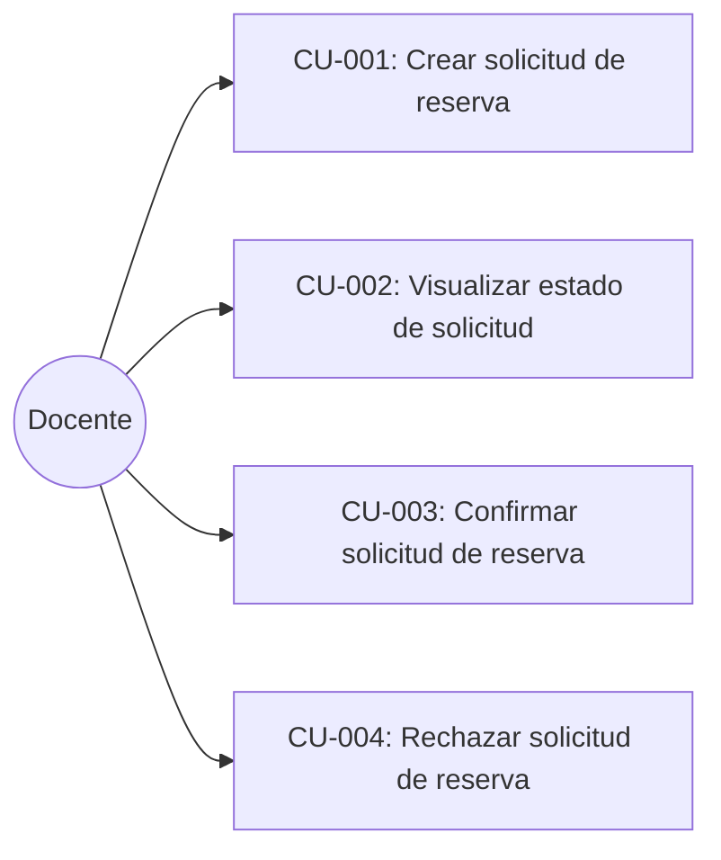
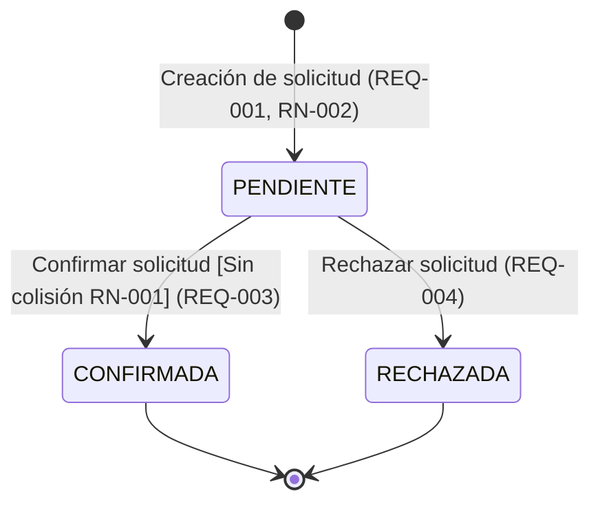
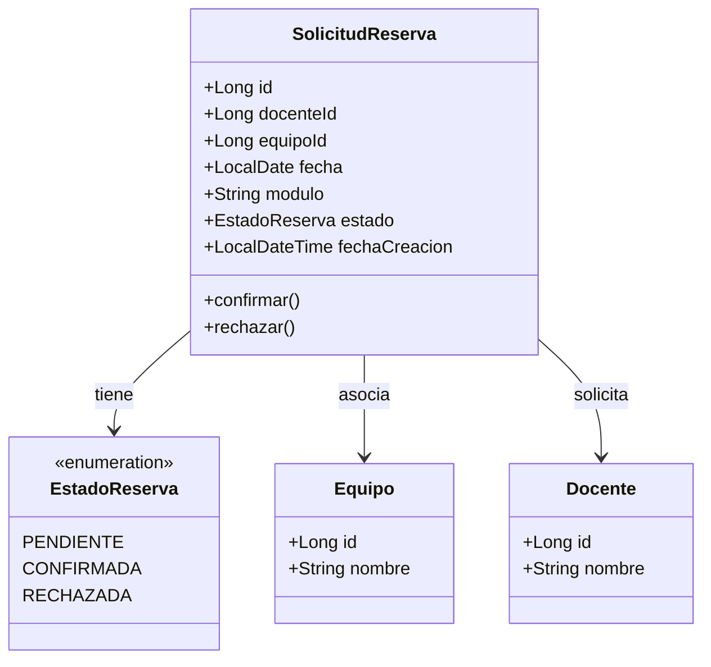
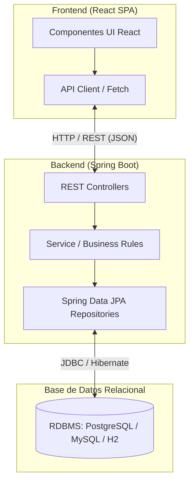

# Documento de Especificación del Sistema (SSD)
## Proyecto: Biblioteca Horizonte - MVP Gestión de Reservas

---

### 1. Objetivo del sistema
Proveer una solución web desacoplada (Frontend en React y Backend en Spring Boot con base de datos relacional) para la gestión esencial del ciclo de vida de solicitudes de reserva de equipos para docentes en la Biblioteca Horizonte. El sistema busca asegurar el registro ordenado de solicitudes y garantizar la disponibilidad física de los recursos evitando solapamientos temporales sobre un mismo equipo.

---

### 2. Alcance
El Producto Mínimo Viable (MVP) cubre exclusivamente los siguientes requerimientos funcionales:

| Identificador | Descripción del Requerimiento |
| :--- | :--- |
| **REQ-001** | El sistema debe permitir a un docente crear y registrar una solicitud de reserva indicando docente solicitante, equipo, fecha y módulo horario. |
| **REQ-002** | El sistema debe registrar toda nueva solicitud en estado inicial `PENDIENTE` y permitir su visualización en dicho estado. |
| **REQ-003** | El sistema debe permitir ejecutar la confirmación de una solicitud de reserva que se encuentre en estado `PENDIENTE`. |
| **REQ-004** | El sistema debe permitir ejecutar el rechazo de una solicitud de reserva que se encuentre en estado `PENDIENTE`. |
| **REQ-005** | El sistema debe validar e impedir la existencia de más de una reserva en estado `CONFIRMADA` para la misma combinación de equipo, fecha y módulo horario. |
| **REQ-006** | El sistema debe persistir los datos de reservas, equipos y sus transiciones de estado en una base de datos relacional. |
| **REQ-007** | El sistema debe proveer una interfaz web (SPA en React) para realizar la solicitud, consultar su estado y ejecutar las acciones de confirmación y rechazo. |

---

### 3. Fuera de alcance
Quedan explícitamente excluidas del MVP las siguientes funcionalidades:

- **Recordatorios por correo electrónico:** Ningún tipo de notificación, alerta o recordatorio vía email o mensajería forma parte de este MVP (diferido formalmente para futuras versiones).
- **Cancelación o edición de reservas:** Modificación de fechas/módulos o cancelación de reservas una vez confirmadas o rechazadas.
- **Gestión de inventario / ABM de equipos:** Altas, bajas y modificaciones administrativas de equipos, inventario físico o estado de mantenimiento.
- **Autenticación y autorización avanzada:** Mecanismos complejos de Single Sign-On (SSO), LDAP, recuperación de contraseñas o control de acceso basado en roles jerárquicos (RBAC) detallados.
- **Múltiples equipos por solicitud:** Reserva de más de un equipo en un mismo registro de solicitud.
- **Reportes estadísticos y exportación de datos:** Generación de métricas de uso, reportes PDF o exportaciones Excel.

---

### 4. Actores
- **Docente:** Usuario del ámbito académico que interactúa con la aplicación para solicitar la reserva de equipos para una fecha y módulo, y visualizar el estado de sus solicitudes.
- *Nota sobre rol aprobador:* En el requerimiento original se establece que el sistema debe permitir que un "docente" pueda crear, ver pendiente, confirmar y rechazar solicitudes. No se explicita la existencia de un rol diferenciado (como "Bibliotecario" o "Administrador"). Se mantiene al Docente como actor principal del MVP, documentando esta distinción en la sección de decisiones a confirmar.

---

### 5. Casos de uso



#### **CU-001: Crear solicitud de reserva**
- **Actor:** Docente.
- **Precondición:** El equipo solicitado debe existir en el catálogo del sistema.
- **Flujo Principal:**
  1. El docente selecciona el equipo, especifica la fecha y el módulo horario deseado.
  2. El docente envía la solicitud.
  3. El sistema valida la integridad de los datos provistos.
  4. El sistema crea y persiste la solicitud en estado `PENDIENTE`.
  5. El sistema confirma la creación retornando los datos de la solicitud y su identificador.
- **Flujo Alternativo:**
  - 3a. Datos incompletos o inválidos: El sistema rechaza la petición indicando el error de validación.

#### **CU-002: Visualizar estado de solicitud**
- **Actor:** Docente.
- **Precondición:** Existe al menos una solicitud creada en el sistema.
- **Flujo Principal:**
  1. El docente consulta la lista de solicitudes o una solicitud puntual por identificador.
  2. El sistema recupera la información y presenta los datos de la reserva junto con su estado actual (`PENDIENTE`, `CONFIRMADA` o `RECHAZADA`).

#### **CU-003: Confirmar solicitud de reserva**
- **Actor:** Docente.
- **Precondición:** La solicitud debe existir y estar en estado `PENDIENTE`.
- **Flujo Principal:**
  1. El usuario solicita confirmar una reserva específica en estado `PENDIENTE`.
  2. El sistema valida que no exista ninguna otra reserva en estado `CONFIRMADA` para el mismo equipo, fecha y módulo horario (**RN-001**).
  3. El sistema transiciona el estado de la solicitud a `CONFIRMADA`.
  4. El sistema persiste el cambio y retorna la solicitud actualizada.
- **Flujos Alternativos:**
  - 2a. Ya existe una reserva `CONFIRMADA` para el mismo equipo, fecha y módulo: El sistema rechaza la confirmación informando conflicto de asignación (**RN-001**).
  - 2b. La solicitud no se encuentra en estado `PENDIENTE`: El sistema rechaza la operación informando que la transición es inválida (**RN-003**).

#### **CU-004: Rechazar solicitud de reserva**
- **Actor:** Docente.
- **Precondición:** La solicitud debe existir y estar en estado `PENDIENTE`.
- **Flujo Principal:**
  1. El usuario solicita rechazar una reserva específica en estado `PENDIENTE`.
  2. El sistema valida que la solicitud se encuentre en estado `PENDIENTE`.
  3. El sistema transiciona el estado de la solicitud a `RECHAZADA`.
  4. El sistema persiste el cambio y retorna la solicitud actualizada.
- **Flujo Alternativo:**
  - 2a. La solicitud no se encuentra en estado `PENDIENTE`: El sistema rechaza la operación informando que la transición es inválida (**RN-003**).

---

### 6. Reglas de negocio

| Identificador | Regla de Negocio |
| :--- | :--- |
| **RN-001** | **Regla Fundamental de No Superposición:** No puede existir más de una reserva en estado `CONFIRMADA` para la misma combinación de (equipo + fecha + módulo horario). |
| **RN-002** | **Estado Inicial Obligatorio:** Toda nueva solicitud de reserva debe ingresar al sistema indefectiblemente en estado `PENDIENTE`. |
| **RN-003** | **Validez de Transiciones de Estado:** Las transiciones de estado solo están permitidas desde el estado `PENDIENTE`. Los estados `CONFIRMADA` y `RECHAZADA` son terminales en este MVP; ninguna solicitud confirmada o rechazada puede volver a transicionar. |
| **RN-004** | **Coexistencia de Solicitudes Pendientes:** Múltiples solicitudes pueden coexistir en estado `PENDIENTE` para el mismo equipo, fecha y módulo; la verificación de exclusividad se evalúa y aplica en el momento de la confirmación. |
| **RN-005** | **Integridad de Datos Requeridos:** Toda solicitud debe contar de manera obligatoria con la referencia al docente, el equipo, una fecha válida y un módulo horario definido. |

---

### 7. Estados y transiciones



- **PENDIENTE:** Estado asignado por defecto al registrar la solicitud. El recurso no está formalmente reservado de manera exclusiva, pero la solicitud está registrada a la espera de confirmación o rechazo.
- **CONFIRMADA:** Estado definitivo que asegura la asignación del equipo en la fecha y módulo especificados. Bloquea cualquier otra confirmación para esa tupla (equipo, fecha, módulo).
- **RECHAZADA:** Estado definitivo que desestima la solicitud de reserva. El cupo del equipo para esa fecha y módulo permanece libre (o disponible para otra solicitud).

---

### 8. Datos necesarios

A partir del requerimiento, se identifican los siguientes datos indispensables:

1. **Datos de la Solicitud de Reserva:**
   - `id`: Identificador unívoco de la reserva (numérico o UUID).
   - `docenteId` / `docente`: Identificador o referencia del docente que solicita.
   - `equipoId` / `equipo`: Identificador del equipo solicitado.
   - `fecha`: Fecha de la reserva (formato ISO-8601: `YYYY-MM-DD`).
   - `modulo`: Módulo horario en el que se requiere el equipo (ej: `MODULO_1`, `08:00-09:30`, etc.).
   - `estado`: Estado actual de la reserva (`PENDIENTE`, `CONFIRMADA`, `RECHAZADA`).
   - `fechaCreacion`: Marca temporal del momento de registro de la solicitud.

2. **Datos del Equipo (Mínimos):**
   - `id`: Identificador del equipo.
   - `nombre` / `descripcion`: Denominación del equipo (ej: "Proyector EPSON 01", "Notebook HP 03").

3. **Datos del Docente (Mínimos):**
   - `id`: Identificador del docente (ej: legajo o identificador interno).
   - `nombre`: Nombre o identificación referencial del docente.

---

### 9. Modelo de dominio preliminar



---

### 10. Arquitectura propuesta

Arquitectura desacoplada en dos capas principales comunicadas mediante protocolo HTTP y formato JSON:



- **Frontend:** Single Page Application (SPA) construida en React. Maneja el estado de la interfaz, presentación visual y consumo de la API REST.
- **Backend:** Aplicación Java con Spring Boot. Expone los endpoints REST, encapsula la lógica de negocio, gestiona transacciones y validaciones de integridad.
- **Persistencia:** Base de datos relacional para garantizar consistencia ACID y soporte de constraints/índices para la regla **RN-001**.

---

### 11. Responsabilidades del backend
- Exponer endpoints REST normalizados para la gestión de solicitudes de reserva.
- Validar las entradas de datos (obligatoriedad de campos, formato de fechas y módulos).
- Forzar el estado inicial `PENDIENTE` en toda nueva reserva.
- Implementar la validación y protección de concurrencia para **RN-001** (evitar que dos peticiones simultáneas confirmen la misma fecha/módulo/equipo).
- Controlar las transiciones de estado válidas (**RN-003**).
- Persistir entidades en la base de datos relacional mediante Spring Data JPA.
- Gestionar excepciones y retornar códigos de respuesta HTTP adecuados (200, 201, 400, 404, 409, 500) acompañados de mensajes estructurados.

---

### 12. Responsabilidades del frontend
- Proveer una interfaz gráfica intuitiva y clara para que el docente interactúe con el sistema.
- Formulario de alta para la creación de solicitudes (selección de equipo, fecha, módulo horario y docente).
- Vista de consulta donde se listen las solicitudes y se evidencie visualmente su estado (`PENDIENTE`, `CONFIRMADA`, `RECHAZADA`).
- Acciones interactivas accesibles para "Confirmar" o "Rechazar" una solicitud en estado pendiente.
- Capturar y presentar retroalimentación visual amigable ante respuestas exitosas y errores del backend (especialmente advertencias ante colisiones de horario HTTP 409).
- Desacoplamiento total de la lógica de negocio crítica: el frontend no decide si una reserva es válida, delega y respeta las respuestas de la API.

---

### 13. Contrato preliminar de la API REST

#### **1. Crear Solicitud de Reserva**
- **Método y Ruta:** `POST /api/v1/reservas`
- **Request Body:**
  ```json
  {
    "docenteId": 1,
    "equipoId": 10,
    "fecha": "2026-10-15",
    "modulo": "M1"
  }
  ```
- **Respuesta Exitosa (`201 Created`):**
  ```json
  {
    "id": 101,
    "docenteId": 1,
    "equipoId": 10,
    "fecha": "2026-10-15",
    "modulo": "M1",
    "estado": "PENDIENTE",
    "fechaCreacion": "2026-09-24T16:30:00Z"
  }
  ```

#### **2. Listar Solicitudes de Reserva**
- **Método y Ruta:** `GET /api/v1/reservas`
- **Respuesta Exitosa (`200 OK`):**
  ```json
  [
    {
      "id": 101,
      "docenteId": 1,
      "equipoId": 10,
      "fecha": "2026-10-15",
      "modulo": "M1",
      "estado": "PENDIENTE",
      "fechaCreacion": "2026-09-24T16:30:00Z"
    }
  ]
  ```

#### **3. Obtener Detalle de una Solicitud**
- **Método y Ruta:** `GET /api/v1/reservas/{id}`
- **Respuesta Exitosa (`200 OK`):**
  ```json
  {
    "id": 101,
    "docenteId": 1,
    "equipoId": 10,
    "fecha": "2026-10-15",
    "modulo": "M1",
    "estado": "PENDIENTE",
    "fechaCreacion": "2026-09-24T16:30:00Z"
  }
  ```

#### **4. Confirmar Solicitud de Reserva**
- **Método y Ruta:** `POST /api/v1/reservas/{id}/confirmar` *(o `PATCH /api/v1/reservas/{id}/confirmar`)*
- **Respuesta Exitosa (`200 OK`):**
  ```json
  {
    "id": 101,
    "docenteId": 1,
    "equipoId": 10,
    "fecha": "2026-10-15",
    "modulo": "M1",
    "estado": "CONFIRMADA",
    "fechaCreacion": "2026-09-24T16:30:00Z"
  }
  ```
- **Respuestas de Error:**
  - `409 Conflict`: Ya existe otra reserva confirmada para ese equipo, fecha y módulo (**RN-001**), o la solicitud no estaba en estado `PENDIENTE` (**RN-003**).
  - `404 Not Found`: No existe la reserva con el ID especificado.

#### **5. Rechazar Solicitud de Reserva**
- **Método y Ruta:** `POST /api/v1/reservas/{id}/rechazar` *(o `PATCH /api/v1/reservas/{id}/rechazar`)*
- **Respuesta Exitosa (`200 OK`):**
  ```json
  {
    "id": 101,
    "docenteId": 1,
    "equipoId": 10,
    "fecha": "2026-10-15",
    "modulo": "M1",
    "estado": "RECHAZADA",
    "fechaCreacion": "2026-09-24T16:30:00Z"
  }
  ```
- **Respuestas de Error:**
  - `409 Conflict`: La solicitud no se encuentra en estado `PENDIENTE` (**RN-003**).
  - `404 Not Found`: No existe la reserva con el ID especificado.

---

### 14. Manejo de errores

El backend responderá de forma estandarizada ante fallos utilizando el siguiente esquema JSON:

```json
{
  "timestamp": "2026-09-24T16:30:00Z",
  "status": 409,
  "error": "Conflict",
  "codigo": "RESERVA_COLISION_CONFIRMADA",
  "mensaje": "Ya existe una reserva confirmada para el equipo 10 en la fecha 2026-10-15 y módulo M1.",
  "path": "/api/v1/reservas/101/confirmar"
}
```

| Código HTTP | Causa |
| :--- | :--- |
| **`400 Bad Request`** | Parámetros inválidos, tipos de datos incorrectos o ausencia de campos requeridos (docente, equipo, fecha, módulo). |
| **`404 Not Found`** | Solicitud de reserva o entidad referenciada inexistente. |
| **`409 Conflict`** | Violación de **RN-001** (intento de confirmar sobre un módulo ya confirmado para el mismo equipo) o violación de **RN-003** (intentar confirmar o rechazar una solicitud que no está en estado `PENDIENTE`). |
| **`500 Internal Server Error`** | Error no controlado o fallo de infraestructura. |

---

### 15. Casos de prueba

| Caso | Objetivo de la Prueba | Entrada / Condición | Resultado Esperado |
| :--- | :--- | :--- | :--- |
| **CP-001** | Creación válida de solicitud de reserva | Docente válido, equipo válido, fecha futura, módulo "M1" | Código HTTP 201. Solicitud persistida en estado `PENDIENTE`. |
| **CP-002** | Creación inválida por datos faltantes | Solicitud sin especificar módulo ni equipo | Código HTTP 400. Mensaje de validación y la reserva no se crea. |
| **CP-003** | Visualización de solicitud pendiente | Consultar la reserva creada en CP-001 | Código HTTP 200. Estado retornado es `PENDIENTE`. |
| **CP-004** | Confirmación exitosa de solicitud pendiente | Solicitud en estado `PENDIENTE` sin colisiones previas | Código HTTP 200. Estado pasa a `CONFIRMADA`. |
| **CP-005** | Rechazo por colisión de confirmación (**RN-001**) | Confirmar solicitud B (equipo E1, fecha F1, módulo M1) cuando la solicitud A (mismo E1, F1, M1) ya está `CONFIRMADA` | Código HTTP 409 Conflict. Solicitud B permanece en `PENDIENTE` y no se confirma. |
| **CP-006** | Rechazo exitoso de solicitud pendiente | Solicitud en estado `PENDIENTE` | Código HTTP 200. Estado pasa a `RECHAZADA`. |
| **CP-007** | Intento de reconfirmar solicitud ya confirmada (**RN-003**) | Enviar confirmación a una solicitud en estado `CONFIRMADA` | Código HTTP 409 Conflict. Operación rechazada. |
| **CP-008** | Intento de confirmar solicitud ya rechazada (**RN-003**) | Enviar confirmación a una solicitud en estado `RECHAZADA` | Código HTTP 409 Conflict. Operación rechazada. |
| **CP-009** | Concurrencia en confirmación simultánea | Dos peticiones concurrentes para confirmar dos reservas pendientes con idéntico equipo, fecha y módulo | Exactamente una petición recibe 200 OK (`CONFIRMADA`) y la otra recibe 409 Conflict. |

---

### 16. Criterios de aceptación

| Identificador | Criterio de Aceptación |
| :--- | :--- |
| **CA-001** | Dado un docente en la interfaz, cuando ingresa los datos de reserva de un equipo para una fecha y módulo horario y los envía, el sistema registra la solicitud y responde con estado `PENDIENTE` y código 201. |
| **CA-002** | Dado un docente que registró una solicitud, cuando visualiza el listado o detalle de la misma, el sistema le muestra inequívocamente el estado `PENDIENTE`. |
| **CA-003** | Dada una solicitud en estado `PENDIENTE` sin otra reserva confirmada en ese mismo equipo, fecha y módulo, cuando se acciona la confirmación, el sistema actualiza su estado a `CONFIRMADA` y persiste el cambio. |
| **CA-004** | Dada una solicitud en estado `PENDIENTE`, cuando se acciona el rechazo, el sistema actualiza su estado a `RECHAZADA` y persiste el cambio. |
| **CA-005** | Dada una reserva ya `CONFIRMADA` para un equipo $E$, fecha $F$ y módulo $M$, cuando se intenta confirmar cualquier otra solicitud para los mismos $E$, $F$ y $M$, el sistema rechaza la operación, retorna un código de conflicto (409) y no permite la existencia de dos reservas confirmadas para dicho slot. |

---

### 17. Riesgos técnicos

1. **Condición de carrera (Race Condition) en confirmaciones concurrentes:**
   Si dos solicitudes para el mismo equipo, fecha y módulo se encuentran en estado `PENDIENTE` y son confirmadas al mismo milisegundo por dos peticiones distintas, ambas lecturas podrían observar que no hay ninguna confirmada previa si solo se valida a nivel de aplicación en memoria.
   *Mitigación:* Se requerirá una restricción de integridad a nivel de base de datos relacional (ej. índice único condicional `UNIQUE(equipo_id, fecha, modulo) WHERE estado = 'CONFIRMADA'` o bloqueo pesimista `Pessimistic Lock / SELECT ... FOR UPDATE` en la transacción de confirmación).
2. **Compatibilidad del índice único condicional según motor RDBMS:**
   Bases de datos como PostgreSQL soportan índices únicos con cláusula `WHERE`. Otros motores (como MySQL en versiones anteriores a 8.0.13) no soportan índices condicionales nativos con filtro.
   *Mitigación:* Definir el motor relacional de producción o implementar el control mediante bloqueo pesimista en la transacción de Spring Boot (`@Transactional` con aislamiento adecuado o `LockModeType.PESSIMISTIC_WRITE`).
3. **Manejo de fechas y zonas horarias:**
   Diferencias de zona horaria entre el cliente (navegador del usuario) y el servidor pueden alterar la fecha del módulo si se envían formatos `DateTime` completos.
   *Mitigación:* El campo fecha debe ser estrictamente una fecha de calendario pura (`LocalDate` en backend, cadena `YYYY-MM-DD` en API y frontend) sin componente de huso horario.

---

### 18. Decisiones que todavía requieren confirmación

1. **Definición de Actores y Autorización:**
   El requerimiento indica: *"El sistema debe permitir que un docente pueda: 1. Crear/enviar... 2. Ver que la solicitud quedó pendiente... 3. Confirmar una solicitud... 4. Rechazar una solicitud."*
   ¿Cualquier docente puede confirmar o rechazar cualquier solicitud (incluidas las de otros docentes), o existe un rol administrativo / bibliotecario que deba encargarse de las confirmaciones/rechazos?
2. **Estructura y catálogo de los "Módulos":**
   ¿Qué representa un "módulo" exactamente en el contexto institucional? ¿Es una lista fija predeterminada (ej. `Módulo 1: 08:00 - 09:30`, `Módulo 2: 09:45 - 11:15`) o se ingresa libremente?
3. **Catálogo de Equipos y Docentes en el MVP:**
   ¿Los equipos y docentes estarán precargados mediante un script/seed de base de datos, o se ingresan como datos textuales abiertos al crear la reserva?
4. **Impacto en otras solicitudes pendientes al confirmar una:**
   Cuando se confirma una solicitud para un equipo, fecha y módulo, ¿las demás solicitudes pendientes que competían por ese mismo slot deben rechazarse automáticamente por el sistema, o deben permanecer en estado `PENDIENTE` hasta que sean rechazadas manualmente?
5. **Reversibilidad y motivos de rechazo:**
   ¿Se requiere almacenar un motivo de rechazo al pasar una solicitud a `RECHAZADA`? ¿Una reserva `CONFIRMADA` podrá cancelarse en el futuro?
